# Parallelograms-Detection
## Project description: 
Parallelograms appear frequently in images that contain man-made objects. They often correspond to the projections of rectangular surfaces when viewed at an angle that is not perpendicular to the surfaces. In this project, you are to design and implement a program that can detect parallelograms of all sizes in an image.
Your program will consist of three steps: (1) detect edges using the Sobel’s operator, (2) detect straight line segments using the Hough Transform, and (3) detect parallelograms from the straight-line segments detected in step (2). In step (1), compute edge magnitude using the formula below and then normalize the magnitude values to lie within the range [0,255]. Next, manually choose a threshold value to produce a binary edge map.
Edge Magnitude =    (Gx and Gy are the horizontal and vertical gradients, respectively.)
The test images that will be provided to you are in color so you will need to convert them into grayscale images by using the formula luminance = 0.30R + 0.59G + 0.11B, where R, G, and B, are the red, green, and blue components. Test images in both JPEG band RAW image formats will be provided. In the RAW image format, the red, green, and blue components of the pixels are recorded in an interleaved manner, occupying one byte per color component per pixel (See description below).  The RAW image format does not contain any header bytes.

# Steps:
## (1) convert them into grayscale images

convert them into grayscale images by using the formula luminance = 0.30R + 0.59G + 0.11B
```
function [gray]=grayimg(img)
%img=imread('TestImage1c.jpg');
R=double(img(:,:,1));
G=double(img(:,:,2));
B=double(img(:,:,3));
gray=0.30*R + 0.59*G + 0.11*B;
%fprintf('%f',max(max(gray3)));
%gray=double(gray3)/double(max(max(gray3)))*255.0;
```

detect edges using the Sobel’s operator,Sobel operator:

<script type="text/javascript" src="http://cdn.mathjax.org/mathjax/latest/MathJax.js?config=default">	
$$
  \begin{matrix}
   1 & 2 & 3 \\
   4 & 5 & 6 \\
   7 & 8 & 9
  \end{matrix} \tag{1}
$$
</script>

$$
	\begin{matrix}
	-1 & 0 & 1 \\
	-2 & 0 & 2 \\
	-1 & 0 & 1
	\end{matrix}
$$


		
		[-1 -2 -1]
Gy=	[ 0  0  0]*A
		[ 1  2  1]

G=   Math.sqrt(Gx^2,Gy^2)

## Code:

```
clear;
sourcePic=imread('TestImage3.jpg');
%grayPic=mat2gray(sourcePic);
 
%have zray l
%newGrayPic=rgb2gray(sourcePic);%convert 3D - 2D
grayPic=grayimg(sourcePic);
%figure;
%imshow(grayPic);
[m,n]=size(grayPic);
newGrayPic=zeros(m,n);
[m,n]=size(newGrayPic);
%newGrayPic2=rgb2gray(sourcePic);
sobelNum=0;
sobelThreshold=40;%1 40; 2 70-80; 3 40
for j=2:m-1 
    for k=2:n-1
        sobelNum=sqrt((grayPic(j-1,k+1)+2*grayPic(j,k+1) ...
            +grayPic(j+1,k+1)-grayPic(j-1,k-1)-2*grayPic(j,k-1)-grayPic(j+1,k-1))^2+ ...
            (grayPic(j-1,k-1)+2*grayPic(j-1,k)+grayPic(j-1,k+1)-grayPic(j+1,k-1) ...
            -2*grayPic(j+1,k)-grayPic(j+1,k+1))^2);
        if(sobelNum > sobelThreshold)
            newGrayPic(j,k)=255;
        else
            newGrayPic(j,k)=0;
        end
    end
end
figure;
imshow(newGrayPic) 
title('Sobel???????')

```


## In order to detect accurate straight lines, we improve the detection with canny and

### improve canny with Sobel operator instead of [-1,1;-1,1].

### Code:

```
f unct i on [ m, t het a, sect or, ca nn y 1, ca nn y 2, bi n] = ca nn y 1st ep( sr c, l o wTh , hi gh Th)
[ Ay, Ax, di m ] = si ze( sr c);
if di m>
sr c = r gb2 gr a y( sr c);
e n d
sr c = dou bl e( sr c);
m = zer os( Ay, Ax);
t het a = zer os( Ay, Ax);
s ect or = zer os( Ay, Ax);
c a n n y 1 = zer os( Ay, Ax);%??? ???
c a n n y 2 = zer os( Ay, Ax);%??? ??? ??
bi n = zer os( Ay, Ax);
f or y = 2: ( Ay-1)
f or x = 2: ( Ax-1)
gx = sr c( y-1, x+1) + 2*sr c( y, x +1) + sr c( y +1, x +1) - ...
sr c( y-1, x-1) - 2*sr c( y, x-1) - sr c( y +1, x-1);
gy = sr c( y +1, x-1) + 2*sr c( y +1, x) + sr c( y +1, x +1) ...

- sr c( y-1, x-1) - 2*sr c( y-1, x) - sr c( y-1, x +1) ;
m( y, x) = ( gx^2 +g y ^ 2) ^0. 5 ;
%- - ------------------------------
t het a( y, x) = at and( gx/ gy) ;
t e m = t het a( y, x);
%- - ------------------------------
if (t e m<6 7. 5) &&( t e m>2 2. 5)
sect or ( y, x) = 0;
el sei f (t e m<2 2. 5) &&( t e m>-2 2. 5)
sect or ( y, x) = 3;
el sei f (t e m<-2 2. 5) &&( t e m>-6 7. 5)
sect or ( y, x) = 2;
el se
sect or ( y, x) = 1;
end
%- - ------------------------------
end
e n d
%- - - - ---------------------
%??????
%- - - - --> x
% 2 1 0
% 3 X 3
%y 0 1 2
f or y = 2: ( Ay-1)
f or x = 2: ( Ax-1)
if sect or ( y, x) ==0 %?? - ??
if ( m( y, x) > m( y-1, x +1) ) &&( m( y, x) > m( y +1, x-1) )
ca nn y 1( y, x) = m( y, x);
el se
ca nn y 1( y, x) = 0;
end
el sei f sect or ( y, x) ==1 %?? ??
if ( m( y, x) > m( y-1, x) ) &&( m( y, x) > m( y +1, x) )
ca nn y 1( y, x) = m( y, x);
el se
ca nn y 1( y, x) = 0;
end
el sei f sect or ( y, x) ==2 %?? - ??
if ( m( y, x) > m( y-1, x-1) ) &&( m( y, x) > m( y +1, x +1) )
ca nn y 1( y, x) = m( y, x);
el se
ca nn y 1( y, x) = 0;
end
el sei f sect or ( y, x) ==3 %???
if ( m( y, x) > m( y, x +1) ) &&( m( y, x) > m( y, x-1) )
ca nn y 1( y, x) = m( y, x);
el se
ca nn y1( y, x) = 0;
end
end
end%e n d f or x
e n d%e n d f or y


f or y = 2: ( Ay-1)
f or x = 2: ( Ax-1)
if cann y 1( y, x) <l o wTh %??? ??
ca nn y 2( y, x) = 0;
bi n( y, x) = 0;
cont i nue;
el sei f ca nn y 1( y, x) >hi gh Th %??? ??
ca nn y 2( y, x) = ca nn y 1( y, x);
bi n( y, x) = 1;
cont i nue;
el se %?? ?? ??? 8? ?? ??? ??? ??? ???? ???
t e m =[ ca n n y 1( y-1, x-1), cann y 1( y-1, x), cann y 1( y-1, x +1);
cann y 1( y, x-1), ca nn y 1( y, x), cann y 1( y, x +1) ;
cann y 1( y +1, x-1), cann y 1( y +1, x), cann y 1( y +1, x +1) ];
t e mMa x = ma x(t e m) ;
if t e mMa x( 1) > hi gh Th
ca nn y 2( y, x) = t e mMa x( 1);
bi n( y, x) = 1;
cont i nue;
el se
ca nn y 2( y, x) = 0;
bi n( y, x) = 0;
cont i nue;
end
end
end%e n d f or x
e n d%e n d f or y
e n d%e n d of f unct i on
```

### (2) detect straight line segments using the Hough Transform

### Hough Transform

### Create (- 90 o^90 o )*(0, rho) space with 0 value, where rho is the sqrt(x2+y2).

### Get non-0 (edge) data of the image after edge detection, get the (x,y)

### Code:


### Hough Peak:

### Find the max(x,y) in certain local region. Eg,(7*7);

```
f unct i on [ h, t het a, r ho] = hou g h Ts( f, dt het a, dr ho)
if nar gi n < 3
dr ho = 1;
e n d
if nar gi n < 2
dt het a = 1;
e n d
f = dou bl e( f);
[ M, N] = si ze( f);
t het a = li ns pac e(-90, 0, ceil ( 90/ dt het a) + 1);
t het a = [t het a -fli pl r(t het a( 2: end - 1) )];
nt het a = l engt h(t het a);
D = s qrt (( M - 1) ^2 + ( N - 1) ^2);
q = ceil ( D/ dr ho) ;
nr ho = 2*q - 1;
r ho = li ns pace(-q*dr ho, q*dr ho, nr ho);
[ x, y, val ] = fi nd( f);
x = x - 1; y = y - 1;
% I ni ti ali ze out put.
h = zer os( nr ho, l engt h(t het a));
% To a v oi d e xcessi ve me mor y us a ge, pr ocess 100 0 no nzer o pi xel
% v al ues at a ti me.
f or k = 1: ceil (l engt h( val )/ 100 0)
first = ( k - 1) *10 0 0 + 1;
l ast = mi n( fi rst +9 9 9, l engt h( x) );
x_ mat ri x = r ep mat ( x( fi r st:l ast ), 1, nt het a);
y_ mat ri x = r ep mat ( y( fi r st:l ast ), 1, nt het a);
val _ mat ri x = r ep mat ( val (fi rst:l ast ), 1, nt het a);
t het a _ mat ri x = r ep mat (t het a, si ze( x_ mat ri x, 1), 1) *pi/ 180;
r ho_ mat ri x = x_ mat ri x. *c os(t het a_ mat ri x) + ...
y_ mat ri x. *si n(t het a _ mat ri x);
sl ope = ( nr ho - 1)/ (r ho( e nd) - r ho( 1) );
r ho_ bi n_i nde x = r oun d( sl ope *( r ho _ mat ri x - r ho( 1) ) + 1);
t het a _bi n_i nde x = r ep mat ( 1: nt het a, si ze( x_ mat ri x, 1), 1);
h = h + f ull ( s par se( r ho_ bi n_i nde x(: ), t het a _bi n_i nde x(: ), ...
val _ mat ri x(: ), nr ho, nt het a));
e n d
f unct i on [r, c, hne w] = hpea k( h, nho o d)
if nar gi n < 2
nho o d = si ze( h)/ 50;
% Ma ke s ur e t he nei ghb or ho o d si ze i s odd.
nho o d = ma x( 2*c eil ( nho o d/ 2) + 1, 1);
e n d
h ma x = ma x( h( : ));
h ne w = h; r = []; c = [];
[ h m, hn] =si ze( h);
l ocal ma xa =8 0;%2 n d 80; 3r d 5
l ocal ma x b =1 0;%2 n d 10; 3r d 5
f or ha =1 +l oc al ma xa: l ocal ma x a * 2: h m-l ocal ma x a
f or hb =1 +l ocal ma x b: l ocal ma x b * 2: hn-l ocal ma x b
hne wp =h ne w( ha-l ocal ma xa: ha +l ocal ma xa, hb-l ocal ma x b: hb +l ocal ma x b);
if( ma x( hne wp( : )) ~=0 &&ma x( h ne wp( : )) >=h ma x * 0. 2)%2 n d 0. 2 3r d0. 15
[ p, q] =f i nd( hne wp = = ma x( h ne wp( : )));
p=p +ha-l ocal ma xa-1;
q=q +h b-l ocal ma x b-1;
p=p( 1); q =q( 1);
r( end +1) =p; c( e nd +1) =q;
end
end
e n d
```

### The result of straight lines detection:
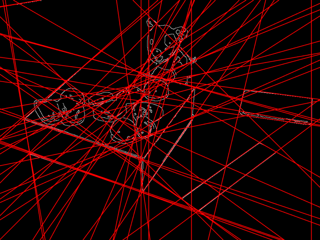

### Then thin the number of lines:

### EG:

### thin the number lines from 65->50
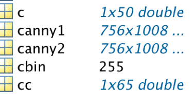


### get the lines couple whose theta was like,
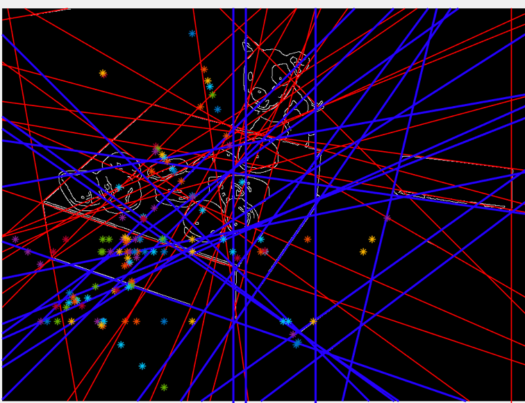

### And get the lines couple’s points where they cross each other.

### Calculate the function of two variable equation

### Detect point of parallelograms

### EG:
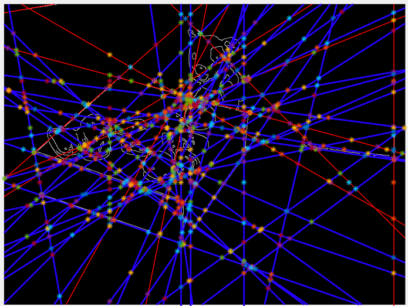


### (3) detect parallelograms from the straight-line segments detected in step (2).

### Firstly, determine pairs of parallel lines and from the parallel lines determine candidate parallelograms by computing the lines' intersection points.

### Then compute the number of edge points (in percentage) that are present on each of the four sides of the candidate parallelograms; if the percentage is high, it is a parallelogram.

### All parallelogram:
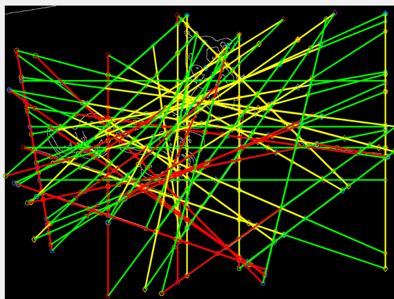

### parallelogram that is accurate:
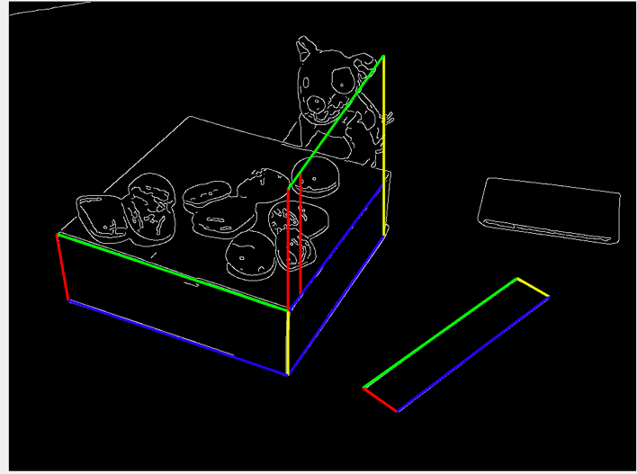

### Result and step of the next two img:
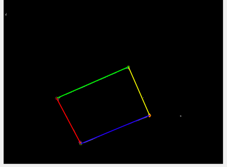

### 1.straight lines:
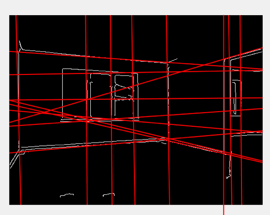
### 2.parallelogram:
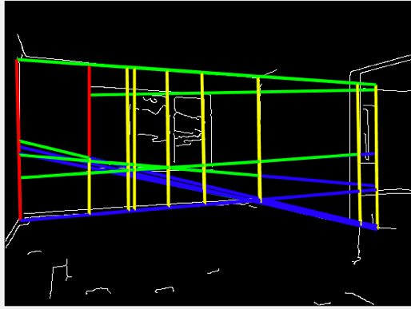
### Improve:
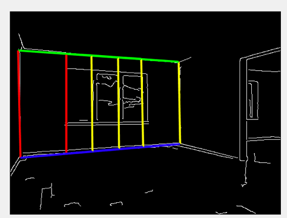


### This part is optional - deal with RAW pictures
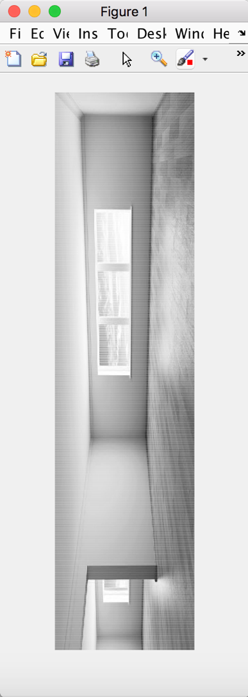
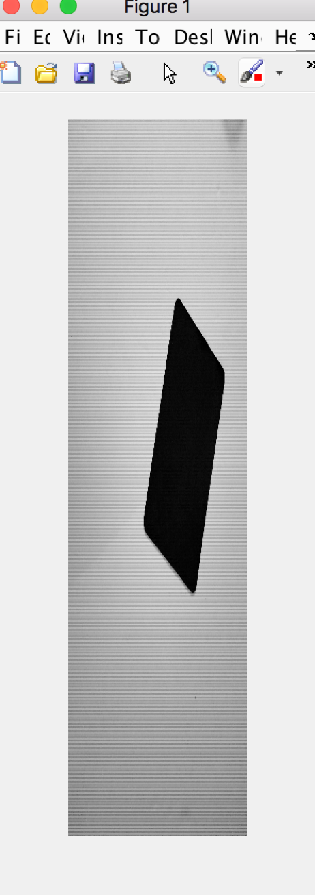
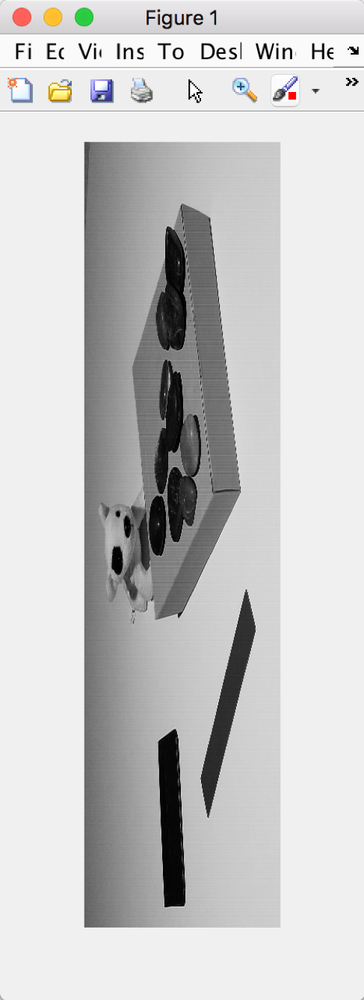


